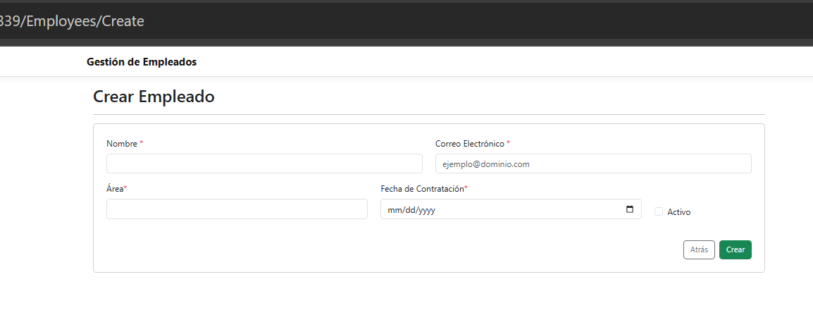

# Employee Management System - Razor Pages

## Descripción del Proyecto

Aplicación de gestión de empleados desarrollada con ASP.NET Core Razor Pages 3.0 que permite realizar operaciones CRUD (Crear, Leer, Actualizar, Eliminar) sobre registros de empleados. La aplicación incluye:

- CRUD completo de empleados (Nombre, Correo, Área, Fecha de ingreso, Estado activo/inactivo)
- Base de datos con Entity Framework Core (SQLite o SQL Server LocalDB)
- Validaciones con DataAnnotations
- Componente visual (ViewComponent) que muestra estadísticas de empleados activos/inactivos
- Implementación del patrón Repository
- Diseño responsivo
- Paginación y búsqueda de empleados

## Requisitos Previos

- [.NET Core 3.0 SDK](https://dotnet.microsoft.com/download/dotnet-core/3.0)
- Visual Studio 2019 o 2022
- SQL Server Express LocalDB 

## Instrucciones de Despliegue

### 1. Clonar el repositorio

git clone https://github.com/denebMM/employee-management.git
cd employee-management

### 2. Restauración de dependencias
Comando para restaurar los paquetes NuGet:

dotnet restore

### Compilación del proyecto
Comando para compilar antes de correr la aplicación:

dotnet build

### 2. Configurar la base de datos

SQL Server LocalDB

## Modificar appsettings.json:

json
"ConnectionStrings": {
  "DefaultConnection": "Server=(localdb)\\mssqllocaldb;Database=EmployeeManagement;Trusted_Connection=True;MultipleActiveResultSets=true"
}
## Ejecutar migraciones:

dotnet ef database update

## Compilar el proyecto

dotnet build

## Ejecutar la aplicación

dotnet run

### Estructura del Proyecto

EmployeeManagement/
├── Data/
│   ├── Repositories/
│   └── AppDbContext.cs
├── Migrations/
│   
├── Models/
│   ├── Employee.cs
│   ├── EmployeeStatsViewModel.cs
│   └── PaginatedList.cs
├── Pages/
│   ├── Employees/

### Características Clave

## Validaciones Implementadas

Nombre: Solo letras, números y espacios (sin caracteres especiales)

Email: Formato válido de correo electrónico

Fecha de Contratación: No puede ser mayor a la fecha actual

Campos obligatorios: Todos los campos principales son requeridos

### Capturas de la Aplicación

