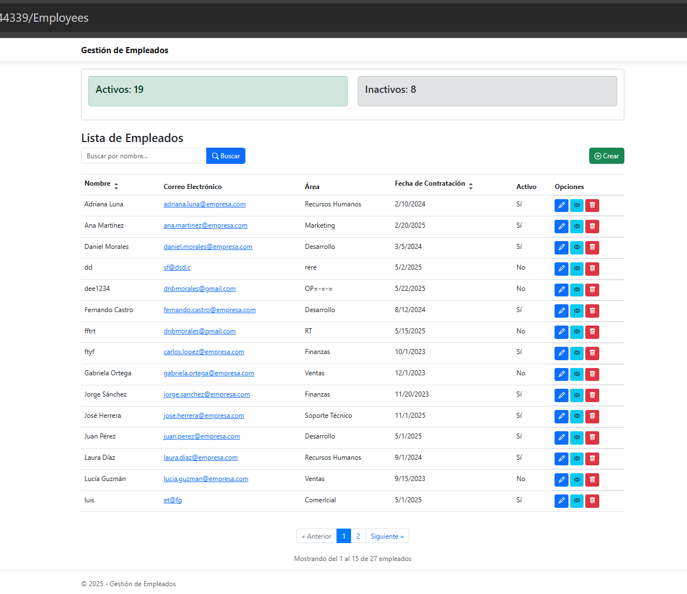
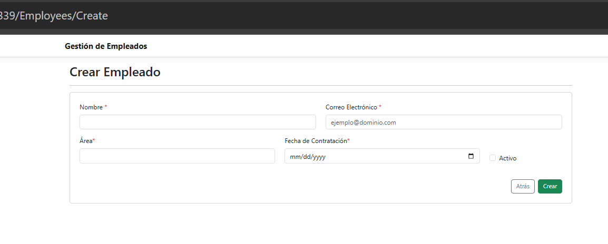
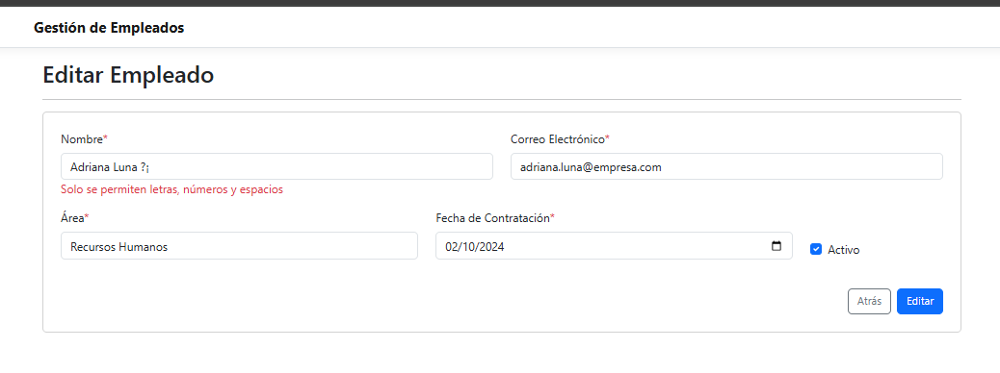
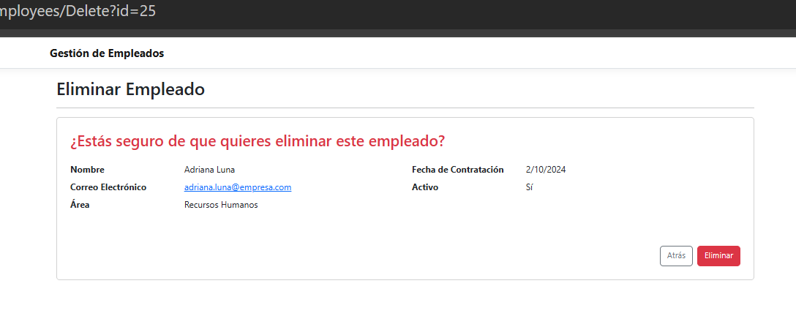
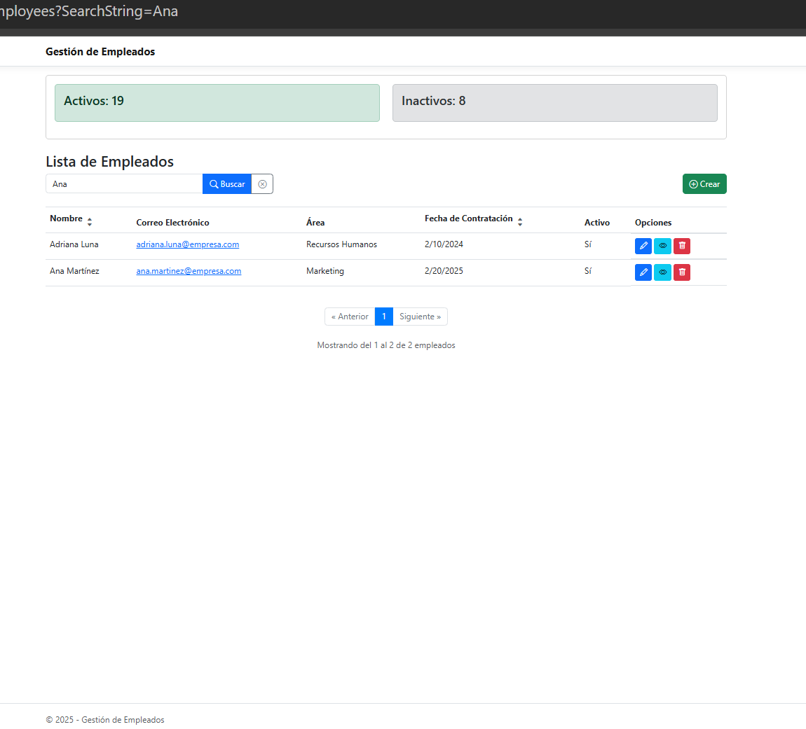

# Employee Management System - Razor Pages

## Descripción del Proyecto

Aplicación de gestión de empleados desarrollada con ASP.NET Core Razor Pages 3.0 que permite realizar operaciones CRUD (Crear, Leer, Actualizar, Eliminar) sobre registros de empleados. La aplicación incluye:

- CRUD completo de empleados (Nombre, Correo, Área, Fecha de ingreso, Estado activo/inactivo)
- Base de datos con Entity Framework Core (SQLite o SQL Server LocalDB)
- Validaciones con DataAnnotations
- Componente visual (ViewComponent) que muestra estadísticas de empleados activos/inactivos
- Implementación del patrón Repository
- Diseño responsivo
- Paginación y búsqueda de empleados

## Requisitos Previos

- [.NET Core 3.0 SDK](https://dotnet.microsoft.com/download/dotnet-core/3.0)
- Visual Studio 2019 o 2022
- SQL Server Express LocalDB 

## Instrucciones de Despliegue

### 1. Clonar el repositorio

 ``` git clone https://github.com/denebMM/employee-management.git ``` 
 ``` cd employee-management  ``` 

## En la Terminal de VS
 ``` cd EmployeeManagement ``` 
  
  luego 

 ``` dotnet ef database update ``` 

### Se debe crear la base de datos así:


ing DbCommand [Parameters=[], CommandType='Text', CommandTimeout='30']
CREATE TABLE [Employees] (
    [Id] int NOT NULL IDENTITY,
    [Name] nvarchar(max) NOT NULL,
    [Email] nvarchar(max) NOT NULL,
    [Area] nvarchar(max) NOT NULL,
    [HireDate] datetime2 NOT NULL,
    [IsActive] bit NOT NULL,
    CONSTRAINT [PK_Employees] PRIMARY KEY ([Id])
);
info: Microsoft.EntityFrameworkCore.Database.Command[20100]
      Executing DbCommand [Parameters=[], CommandType='Text', CommandTimeout='30']
      CREATE TABLE [Employees] (
          [Id] int NOT NULL IDENTITY,
          [Name] nvarchar(max) NOT NULL,
          [Email] nvarchar(max) NOT NULL,
          [Area] nvarchar(max) NOT NULL,
          [HireDate] datetime2 NOT NULL,
          [IsActive] bit NOT NULL,
          CONSTRAINT [PK_Employees] PRIMARY KEY ([Id])
      );
Executing DbCommand [Parameters=[], CommandType='Text', CommandTimeout='30']
INSERT INTO [__EFMigrationsHistory] ([MigrationId], [ProductVersion])
VALUES (N'20250526032127_InitialCreate', N'3.0.0');
info: Microsoft.EntityFrameworkCore.Database.Command[20100]
      Executing DbCommand [Parameters=[], CommandType='Text', CommandTimeout='30']
      INSERT INTO [__EFMigrationsHistory] ([MigrationId], [ProductVersion])
      VALUES (N'20250526032127_InitialCreate', N'3.0.0');
Done.


### Script para insertar empleados

```sql

INSERT INTO [dbo].[Employees] ([Name], [Email], [Area], [HireDate], [IsActive])
VALUES
('Juan Pérez', 'juan.perez@empresa.com', 'Desarrollo', '5/1/2025 12:00:00 AM', 1),
('María García', 'maria.garcia@empresa.com', 'Recursos Humanos', '5/15/2024 12:00:00 AM', 1),
('Carlos López', 'carlos.lopez@empresa.com', 'Finanzas', '10/1/2023 12:00:00 AM', 1),
('Ana Martínez', 'ana.martinez@empresa.com', 'Marketing', '2/20/2025 12:00:00 AM', 1),
('Luis Rodríguez', 'luis.rodriguez@empresa.com', 'Desarrollo', '7/10/2024 12:00:00 AM', 1),
('Sofía Hernández', 'sofia.hernandez@empresa.com', 'Ventas', '1/5/2023 12:00:00 AM', 0),
('Pedro González', 'pedro.gonzalez@empresa.com', 'Soporte Técnico', '3/15/2025 12:00:00 AM', 1),
('Laura Díaz', 'laura.diaz@empresa.com', 'Recursos Humanos', '9/1/2024 12:00:00 AM', 1),
('Jorge Sánchez', 'jorge.sanchez@empresa.com', 'Finanzas', '11/20/2023 12:00:00 AM', 1),
('Mónica Ramírez', 'monica.ramirez@empresa.com', 'Marketing', '4/5/2025 12:00:00 AM', 1),
('Fernando Castro', 'fernando.castro@empresa.com', 'Desarrollo', '8/12/2024 12:00:00 AM', 1),
('Gabriela Ortega', 'gabriela.ortega@empresa.com', 'Ventas', '12/1/2023 12:00:00 AM', 0),
('Ricardo Mendoza', 'ricardo.mendoza@empresa.com', 'Soporte Técnico', '6/15/2025 12:00:00 AM', 1),
('Patricia Silva', 'patricia.silva@empresa.com', 'Recursos Humanos', '1/30/2024 12:00:00 AM', 1),
('Roberto Vargas', 'roberto.vargas@empresa.com', 'Finanzas', '5/10/2023 12:00:00 AM', 1),
('Verónica Ríos', 'veronica.rios@empresa.com', 'Marketing', '7/20/2025 12:00:00 AM', 1),
('Daniel Morales', 'daniel.morales@empresa.com', 'Desarrollo', '3/5/2024 12:00:00 AM', 1),
('Lucía Guzmán', 'lucia.guzman@empresa.com', 'Ventas', '9/15/2023 12:00:00 AM', 0),
('José Herrera', 'jose.herrera@empresa.com', 'Soporte Técnico', '11/1/2025 12:00:00 AM', 1),
('Adriana Luna', 'adriana.luna@empresa.com', 'Recursos Humanos', '2/10/2024 12:00:00 AM', 1);


### 2. Restauración de dependencias

Comando para restaurar los paquetes NuGet:

 ``` dotnet restore ``` 

### Compilación del proyecto
Comando para compilar antes de correr la aplicación:

 ``` dotnet build ``` 

## Compilar el proyecto

 ``` dotnet build ``` 

## Ejecutar la aplicación

 ``` dotnet run ``` 

### Estructura del Proyecto

EmployeeManagement/
├── Data/
│   ├── Repositories/
│   └── AppDbContext.cs
├── Migrations/
│   
├── Models/
│   ├── Employee.cs
│   ├── EmployeeStatsViewModel.cs
│   └── PaginatedList.cs
├── Pages/
│   ├── Employees/

### Características Clave

## Validaciones Implementadas

Nombre: Solo letras, números y espacios (sin caracteres especiales)

Email: Formato válido de correo electrónico

Fecha de Contratación: No puede ser mayor a la fecha actual

Campos obligatorios: Todos los campos principales son requeridos

### Capturas de la Aplicación






